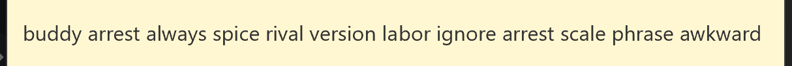

# PrivacyLinks

**Privacy-by-default Web3 Browser Extension**

PrivacyLinks is a browser extension that enables Web3 interactions with privacy by default. It provides fresh addresses for each transaction while ensuring funds come from private and provably non-malicious onchain sources through PrivacyPools integration.

## Features

### 🔐 Privacy by Default
- **Session-based addresses**: Each dApp interaction uses a new address by default, preventing transaction linking and protecting user privacy
- **Address spoofing**: Optional feature to spoof fake rich addresses to dApps for enhanced functionality

### 💰 Private Fund Management
- **PrivacyPools integration**: Funds sourced from private and provably non-malicious onchain pools
- **Pool contract withdrawals**: Secure funding mechanism using smart contracts instead of direct transfers
- **Automatic funding**: Session wallets are automatically funded as needed for transactions

### 🌐 Cross-Chain Compatibility
- **Ethereum L1 native**: Fund transactions on other chains from L1's PrivacyPools.
- **CCIP integration**: Cross-chain transactions through Chainlink's Cross-Chain Interoperability Protocol
- **Multi-chain payments**: Send USDC and other tokens across supported networks

### 🎯 User Experience
The extension requires no effort to the users. Privacy is not something they have to learn how to do, it's
just built in.

## How to Run the Extension

### Prerequisites
- Chrome or Chromium-based browser
- Node.js (v16 or higher)
- A 12-word seed phrase with testnet funds (for demo, see end of README I gotcha ;) ). 

### Installation Steps

#### Option 1: Direct Installation (Recommended)
1. **Clone the repository**
   ```bash
   git clone <repository-url>
   cd PrivatePay
   ```

2. **Load in Chrome**
   - Open Chrome and go to `chrome://extensions/`
   - Enable "Developer mode" (toggle in top right)
   - Click "Load unpacked"
   - Select the `dist/` folder from the project directory

#### Option 2: Build from Source
1. **Clone the repository**
   ```bash
   git clone <repository-url>
   cd PrivatePay
   ```

2. **Install dependencies**
   ```bash
   npm install
   ```

3. **Build the extension**
   ```bash
   npm run build
   ```

4. **Load in Chrome**
   - Open Chrome and go to `chrome://extensions/`
   - Enable "Developer mode" (toggle in top right)
   - Click "Load unpacked"
   - Select the `dist/` folder from the project directory

5. **Setup your wallet**
   - Click the PrivatePay extension icon
   - Enter your 12-word seed phrase
   - Accept the deposit suggestion to fund your pool contract
   - You're ready to use Web3 with privacy!

### Usage
- Navigate to any Web3 dApp (Uniswap works well)
- Connect your wallet (PrivatePay will provide a fresh address, and spoof a rich user (can be turned off))
- Approve transactions through the extension popup
- Monitor transaction progress in real-time

## Tradeoffs and Caveats

### ⚠️ Demo Limitations

**PrivacyPools Integration**: Due to a failure of the testnet site and ASP (Anonymous Set Provider) of PrivacyPools over the weekend, this demo falls back to a mocked Pool contract instead of the full PrivacyPools protocol. The privacy guarantees are demonstrated conceptually but not cryptographically enforced.

**CCIP Token Availability**: While the cross-chain payment code is fully functional, Ethereum Sepolia's whitelisted tokens (USDC, CCIP-BnM) cannot be easily acquired through normal swaps or faucets, making cross-chain demo transactions challenging to execute. They remain possible if you fund the addresses with those tokens.

### 🔒 Security Considerations
- **Testnet only**: This is a proof of concept for testnet demonstration. DO NOT USE WITH YOUR REAL SEED PHRASE.
- **Seed phrase security**: Store your seed phrase securely; it controls all derived addresses
- **Costs**: Each transaction requires funding from the pool, incurring gas costs. PrivacyPools takes a 0.05% commission on withdrawals, and 0.5% on deposits.

---

**Built for ETHGlobal Cannes 2025** 

This project demonstrates privacy-preserving Web3 interactions through fresh address generation and private fund sourcing, showcasing the potential for mainstream privacy adoption in blockchain applications.


## A Little Demo Gift

Here is a little seed gift for your to try out the product easily.



